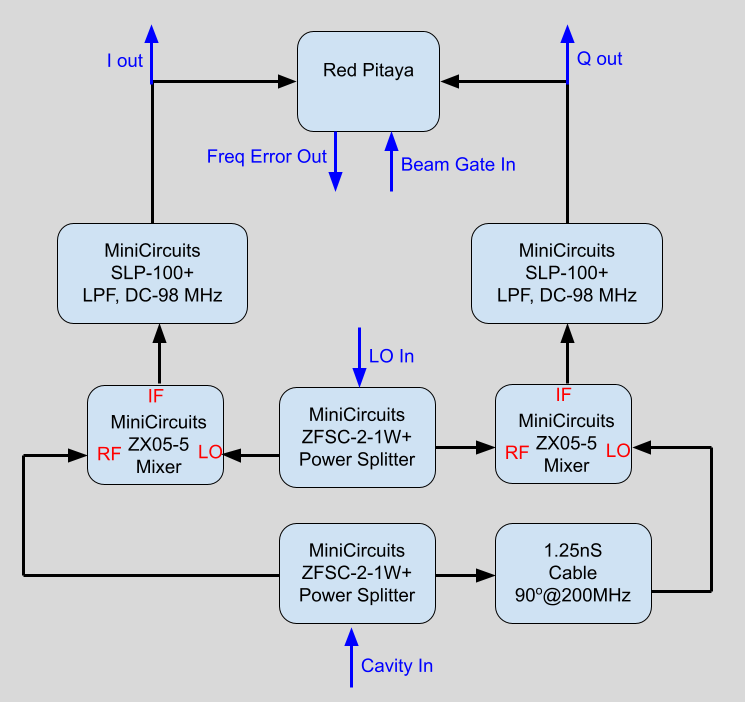
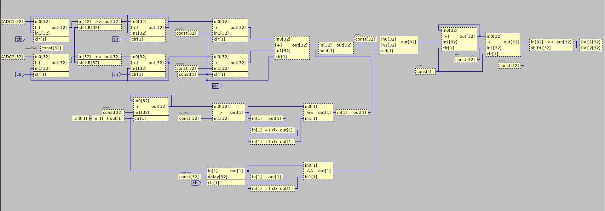
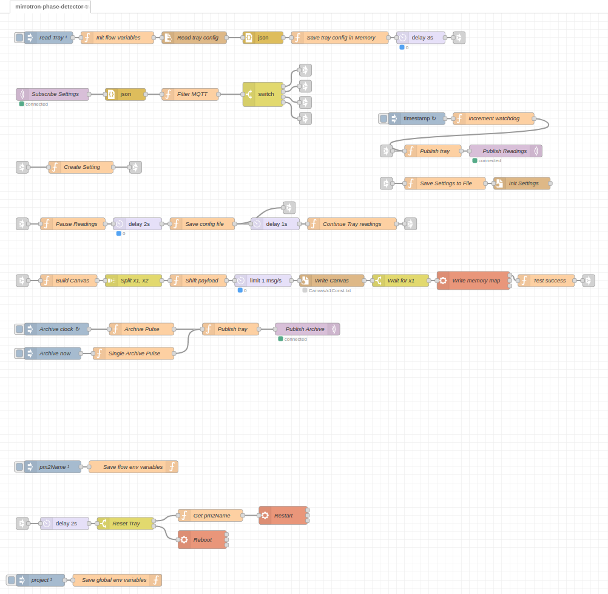

# Four Quadrant IQ Phase Detector
* <a href="https://github.com/bl-mirrotron/mirrotron-phase-detector-tray" target="_blank">Source code</a>
* [RF source overview](https://bl-mirrotron.github.io/#rf-source)
* [Control system overview](https://bl-mirrotron.github.io/)

The purpose of the phase detector is to measure the phase between the cavity drive and the cavity field and then send an error signal to the [RF frequency source](https://bl-mirrotron.github.io/mirrotron-rf-src-tray/) so that the RF frequency source will track the cavity resonance as the cavity temperature changes. The RF circuitry for the phase detector is shown in Figure 1. The circuit compares the in phase and out of phase components of the RF drive with the cavity field and provides I channel and Q channel outputs.

The I-Q channels are digitized by a <a href="https://redpitaya.com/stemlab-125-14/" target="_blank">Red Pitaya Stemlab 125-14</a> FPGA. The FPGA was programmed with the <a href="https://content.redpitaya.com/blog/canvas-a-free-graphical-dsp-design-tool-for-red-pitayas-fpga" target="_blank">CANVAS</a> tool that is a graphical system for implementing digital signal processing functions into the Stemlab 125-14 FPGA. The CANVAS circuit is shown in Figure 2. In the FPGA, the I-Q signals are first low pass filtered. The frequency corner of the low pass filter is adjustable. The IQ signals are then complex multipled with the complex phase target to produce the error signal. Because the signal is pulsed, the phase error is sample and held. The trigger for the sample and held is offset from the input trigger In0. The sample and held error signal is integrated with the previous error signal. The error signal is then multipled and bit shifted to provide a gain multiplication. The final signal is sent to the DAC to be feed back inot the frequency source.

The tray code uses the Blinky-lite Canvas interface in which all settings are mapped to a GPIO memory address on the Red Pitaya. The tray code is shown in Figure 3.

Figure 1.  Phase Detector Block Diagram

 

Figure 2.  Phase Detector DSP Code

 

Figure 3.  RF Frequency Source Tray Code

 

