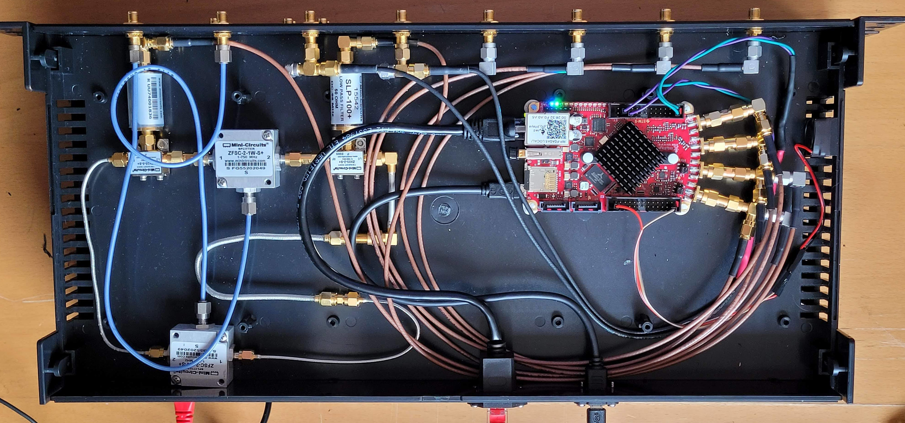

## Four Quadrant IQ Phase Detector
Stuff to write
##### Figure 1 #####
*Phase Detector Block Diagram* 

##### Figure 2 #####
*Phase Detector DSP Code* 

##### Figure 3 #####
*Phase Detector Implementation* 

##### Figure 4 #####
*RF Frequency Source Tray Code* 

